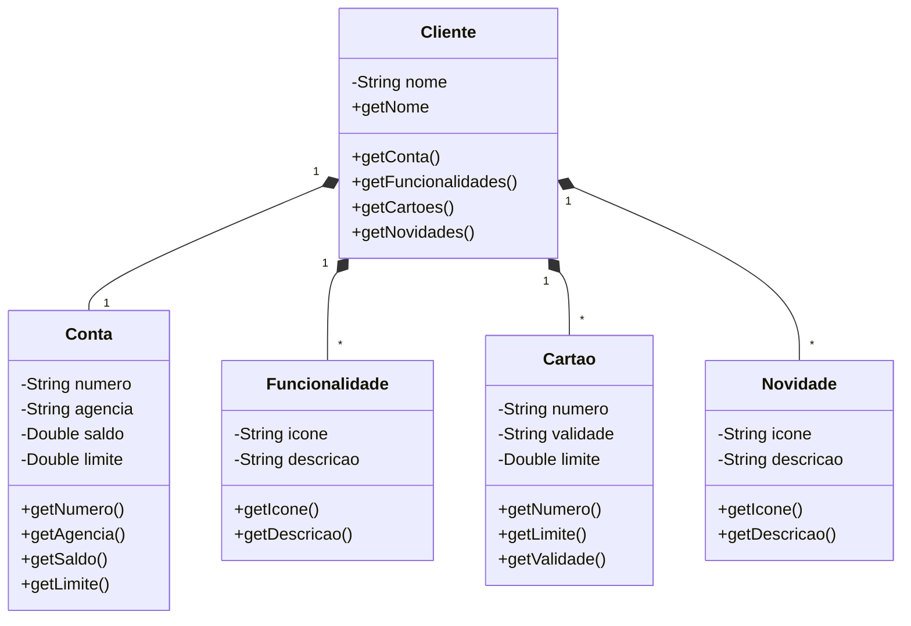

## Diagrama de classes 

```mermaid
classDiagram
    class Cliente {
        -String nome
        +getNome
        +getConta()
        +getFuncionalidades()
        +getCartoes()
        +getNovidades()
    }

    class Conta {
        -String numero
        -String agencia
        -Double saldo
        -Double limite
        +getNumero()
        +getAgencia()
        +getSaldo()
        +getLimite()
    }

    class Funcionalidade {
        -String icone
        -String descricao
        +getIcone()
        +getDescricao()
    }

    class Cartao {
        -String numero
        -String validade
        -Double limite
        +getNumero()
        +getLimite()
        +getValidade()
    }

    class Novidade {
        -String icone
        -String descricao
        +getIcone()
        +getDescricao()
    }

    Cliente "1" *-- "1" Conta
    Cliente "1" *-- "*" Funcionalidade
    Cliente "1" *-- "*" Cartao
    Cliente "1" *-- "*" Novidade

```
